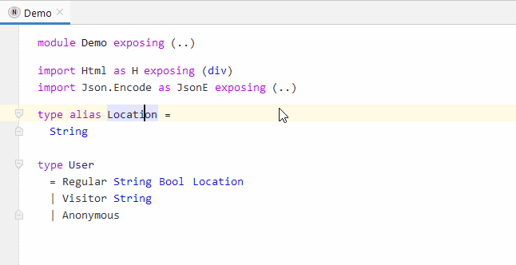

# Table of Contents

1. [elmMPS](#elmMPS)
1. [Disclaimer](#disclaimer)
   1. [What (not) to expect](#what-not-to-expect)
   1. [Please don't ...](#please-dont-)
1. [Examples](#examples)
   1. [Projectional editing - Basics](#projectional-editing---basics)
   1. [Empty Elm-Module](#empty-elm-module)
   1. [Adding a module declaration](#adding-a-module-declaration)
      1. [_Aside:_ about the two name properties](#aside-about-the-two-name-properties)
   1. [Adding an import declaration](#adding-an-import-declaration)
   1. [The substitution menu (aka code completion)](#the-substitution-menu-aka-code-completion)
      1. [_Aside:_ Substitution menu tipp](#aside-substitution-menu-tipp)
   1. [Types and Type Aliases](#types-and-type-aliases)
   1. [Merits of explicitly editing structure](#merits-of-explicitly-editing-structure)
      1. [Duplicating nodes by pressing CTRL+D](#duplicating-nodes-by-pressing-ctrld)
      1. [Reordering sequences by pressing CTRL+ALT+UP/DOWN](#reordering-sequences-by-pressing-ctrlaltupdown)
      1. [Having multiple projections](#having-multiple-projections)
1. [Exploring the project yourself](#exploring-the-project-yourself)

# elmMPS
A prototypical implementation of the elm language (https://elm-lang.org/) in JetBrains MPS (https://www.jetbrains.com/mps/), sporting a projectional editor.

[tl;dr: _jump to examples_](#examples)

# Disclaimer

This project currently has three selfish purposes:
1. To get more familiar with the Elm syntax
2. To learn how to implement nice editor experiences in MPS
3. To experiment with implementing typesystems in MPS

Still, if people of either community (Elm or MPS) are interested to look into this project and provide feedback or ask questions, you are more then welcome to do so.

## What (not) to expect
This project does not have the goal to become a fully fledged implementation of Elm for people to rely upon and use in production. It is really meant to explore mainly the projectional editor and, to a certain degree, the typesystem aspect of MPS. Things like code generation or the import of textual Elm source code are currently out of scope.

## Please don't ...
This is not meant to spawn a general discussion on what's better, projectional or textual editing. I don't see a point in discussing such questions without having a confined context.

# Examples
Since most people are not familiar with JetBrains MPS and it is not so straightforward to "just get started", I decided to put some GIFs in this Readme to demonstrate some of the editor's capabilites. If you are still interested how to browse the MPS project and play with the editor yourself, refer to [this section](README.md#exploring-the-project).

Before I want to explore higher levels of abstraction in the language and the editor, I wanted to try and build a projection that is very close to the concrete syntax of Elm (v0.19.1).
There will be some slight changes sprinkled in here and there, either for the purpose of teasing ideas, or because the projectional editor requires them.

## Projectional editing - Basics
[tl;dr: _show me the examples already_](README.md#empty-Elm-Module)

For those not familiar with projectional editors, here is a nice illustration by Markus Völter that compares textual editing (left) with projectional editing (right).

When you write code as text, a parser is involved to translate your text into a data structure, usually called an Abstract Syntax Tree (AST). Broadly speaking, this data structure is fed into other parts of a compiler to perform certain tasks like semantic analysis, code optimization, translation, and the like. In a projectional world, there is no parser! You create programs by directly manipulating the AST of your program. The "projection" is what exposes the AST to you in one way or the other on a screen. We'll see how this can look like for Elm next, so let's move on and look at specific examples.

## Empty Elm-Module
Since MPS allows you to create an manipulate the AST (tree!) directly, the first class citizen a use ris interacting with in every language are **Nodes**. Nodes live under a (MPS-)model, and each root node can be opened in a separate editor. So I decided to make a _Elm-Module_ a root node. When we create a new Elm-Module, an empty editor looks like this:

It features three placeholders, which could also be hidden, but it is a good practice in projectional editing to work with "placeholder hints" to let users know where a cursor can be placed and the program can be manipulated. Remember, this is not a text file! Think of it as a form-like canvas with context-sensitive interactions.

## Adding a module declaration
Though we are not using a textual editor, the concrete syntax of Elm we try to mimic is textual, so it is only natural to start out with a projectional editor that behaves similarly to a textual editor in many contexts. Declaring a module signature, for example. 

With the cursor at our placeholder, we can just type "module_Demo", where "\_" indicates a SPACE, to add a node of type **ModuleDeclaration** and the name property "Demo".

Adding the **Exposing** node already contains a bit of projectional editing magic. With the cursor at the of our module name, we can continue typing "\_e". The space indicates we finished our module name (just like we do it in a textual editor), but subsequently pressing the "e" key triggers a so-called "side transformation" in MPS. This transformation automatically adds an **Exposure** node to the **ModuleDeclaration**, and since we are in a projectional editor, this node gets rendered on screen immediately.

Now, one can ask why the module itself does not have the same behavior (pressing "m" at the very beginning magically adding the **ModuleDeclaration**). No specific reason other then being able to demonstrate both capabilities in one "line" of code.

Another question that might come up: Why isn't the **Exposure** node immediatly added to the **ModuleDeclaration**, since it is mandatory. While this is true and it could be easily achieved, I erred on the side of a more fluent editing experience, since this is the focus of this project.

Let's look at MPS' _Node Explorer_ for this simple example to verify that we are building a AST. A node in MPS can have **properties**, **children**, and **references**. The node explorer allows us to inspect the structure of a node. In this case, we look at the root node of type (a.k.a. concept) **Module**. Remember that the root node is the "complete editor".

The root node **Module** with the name "Demo" has one child. It's a **ModuleDeclaration** node, also with the a name property of value "Demo". The **Exposue** node is a child of the **ModuleDeclaration** and contains no properties, references, or children.
___
### _Aside:_ about the two name properties
The two name properties are not really redundant. Since a **Module** in Elm does not necessarily have a **ModuleDeclaraion**, the user can still provide a name to the **Module** if required, providing a 'filename' so to speak. However, if there does exist a **ModuleDeclaration**, its name overrides a potential **Module** name, so that the name of the **ModuleDeclaration**, if existent, also automatically determines the "file name".
___

## Adding an import declaration
Let me use the import statement to demonstrate the fluent, text-like input capabilities once more:

Similarly to the **Exposure** node in the **ModuleDeclaration**, adding a **Alias** node is triggered by a side transformation when the user types "\_a" after the name of the imported module (in this case "Html").
Notice that the "Html" module is just a stub module, another root node I declared for demoing purposes.

More interesting is that "Html" is not a name property, but an actual reference to another (**Module**) node, defined in a different MPS model. Again, this one is just a stub, but it demonstrates that **scoping** is also part of the language:

## The substitution menu (aka code completion)
One of the powerful features of MPS is the built-in and customizable sustitution menu. Within a editable cell one can invoke a context-sensitive menu by pressing CTRL+SPACE. This will present you a list of elements that are available ("in scope") in the given context. This menu can be filtered by typing:

This works for references (see import statement), properties (see import alias name), and of course for adding new children (see function declaration).

___
### _Aside:_ Substitution menu tipp
One of many nice things about the substitution menu is that you can use the filtering ability even before you invoke the substitution menu. In the next section about types and type aliases, I start out by writing "ta", knowing that this narrows down the scope to one hit (**type alias**) and press CTRL+SPACE only then. This immediately inserts the corresponding node into our program, since it is unambiguous to MPS what my intention is.
___

## Types and Type Aliases
While still certainly not 100% correct, one can already define basic types and type aliases.

One thing we see is that the formatting is "fixed". Again, this is not a text editor. Instead, the position of the cells for each editor is predetemined. Luckily, this doesn't mean there is no flexibility how cells can be layed out. Rather, the layout of each element in the editor can be defined context sensitive as well, something we will see in a later example.

This example is rather here to show 
a) how fluently the editor can be used, and
b) that there exists no need for rename refactorings

I want to emphasize the second point: Since this is an AST we are interacting with, all references are _real references_. Names (technically) don't matter. Renaming a definition will **automagically update all reference projections**, since that's all they are: projections of the same piece of data, i.e. the name of a declaration. 

## Merits of explicitly editing structure
Let's consider a slightly more complex example. 

Imagine we would like to enhance the "Regular" variant of the **User** type by a **Location** argument type. Due to Elm's concrete syntax, just writing something like "Location String" in a text editor would result in a compiler error:

In our projectional editor, we cannot just type in "Location String", can we? Well, yes and no. We CANNOT make the mistake of forgetting the parentheses, since our editor knows the structure of the language. So, when we add a reference to a node with type arguments, like **Location**, the required fields are added automatically!
The parentheses are also added automatically and just visual aid for the reader. The AST does not care about this kind punctuation, since it has structure.

Still, what if the signature of a declaration changes? Let's imagine **Location** gets a second argument called "b". Let's see what happens: 

We see that, as soon as the declaration of **Location** changes, the reference is marked with an error. We could just add the missing argument manually, but I want to show the intention/quickfix feature. Pressing ALT+ENTER opens another context sensitive menu that offers actions that can be arbitrarily complex. In our case, we just use it to "fix" the **Location** reference by adding a second, initially "empty" type.

We will see more sophisticated examples of the intentions menu later.

Some other nice features that are generally baked in into MPS editors:

### Duplicating nodes by pressing CTRL+D

MPS is smart about which nodes it can duplicate, so it won't allow me to duplicate the module declaration, for example, since there can only be one.

### Reordering sequences by pressing CTRL+ALT+UP/DOWN

This can be very handy to reorganize your code!

### Having multiple projections
Using the **TypeDeclaration** once more, I want to demonstrate another powerful capability of projectional editors, namely multiple projections. Nothing is stopping us to project our AST in different ways. This is particularly powerful for languages of higher levels of abstraction, but it can also be used for educational purposes, by showing or hiding certain things, or just displaying them differently.
For example, to make it more explicit that a constructor is actually defining a function with a signature, I implemented a more "verbose" version of the type editor:

Notice the _Inspector_ window on the bottom. It's a context sensitive window where additional information can be put. It is not necessary to put the "switch" for toggling between available editors there, it's just one way of doing it.

Here is another, slightly longer example of what you can do in a projecitonal editor:

# Exploring the project yourself
Notice that this should work for both Windows and MacOS. However, people with OSX reported issues opening the project or setting up the MPS-extensions library. I try to provide a description that works, but let me know if you still face issues getting the project up and running.

## Required software
- download [MPS 2019.2.3](https://www.jetbrains.com/mps/download/) and install/unpack it
  - notice that, depending on when you read this, version 2019.2.3 might be available for download only from the [previous releases page](https://www.jetbrains.com/mps/download/previous.html) 
- download the [MPS-extensions](https://github.com/JetBrains/MPS-extensions/releases/tag/nightly-2019.2.1139.f3ae18e) (the zip archive), a collection of useful libraries I make use of in this project
  - unzip the archive to a locaiton of your choice; it's recommended to put it close to your MPS installation folder, maybe next to it below a common root folder, to easier find it.

## Setting up the environment / opening the project
- clone/download [this repository](https://github.com/digital-ember/elmMPS)
- start the MPS application (might take a few seconds)
- once started use **Open Project...** and select the root folder of your local copy of this project
- after loading the project for the first time, a path variable that points to the MPS-extensions library is missing, so you cannot successfully build the project yet
  - if you get a little notification on the bottom right that looks like the one below, use the link to open the settings directly
  

  - otherwise, open the settings manually:
    - **Windows**: in the main menu, open "File->Settings..." 
    - **MacOS**: in the main menu, open "MPS->Preferences..."
    - in the top left search bar, enter "path" to filter the settings navigation to easier find the "Path Variables" section
  - in this section use the little "+" Button (find it on the top right for Windows or the bottom left for MacOS) to add a new entry called "mps-extensions" and a value that points to the root directory of the MPS-extensions on your machine 
- if you are prompted to reload the project, agree to that, otherwise you have to close the project and re-open it again manually

### Check to see if MPS-extensions is loaded successfully
- in the project navigator on the left side of MPS, go to **Module Pool** at the botton and see if there are entries under *Languages->com* and *Languages->de*
- if yes, the MPS-extensions have been set up successfully 
- if no, please contact me and I will try to help you get set-up
  

  
_More information on the the project itself yet to come :(_
